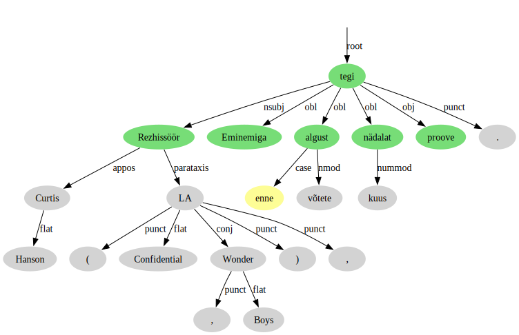

# Verb templates

Code for extracting verbs and their related words from syntax trees for statistical analysis. It can be used for revealing verb patterns, understanding how verbs interact with their arguments, and uncovering semantic restrictions on arguments.

